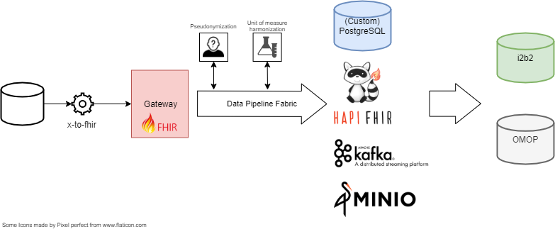

# FHIR Gateway

A thin layer between FHIR REST clients and resource processing pipelines.

## Overview



## Run it

Find the version tag of the latest release here: <https://gitlab.miracum.org/miracum/etl/fhir-gateway/-/releases> and set the IMAGE_TAG environment var to this version:

```sh
export IMAGE_TAG=v3.0.0 # may no longer be the most recent version...
```

Start via compose:

```sh
# adding -f deploy/docker-compose.exposed.yml is optional. It publishes relevant ports of the components to the host network.
docker-compose -f deploy/docker-compose.yml -f deploy/docker-compose.exposed.yml up
```

This starts the gateway (<http://localhost:18080/fhir>), the LOINC conversion service, a PostgreSQL DB storing the received FHIR resources (<localhost:15432>), a GPAS pseudonymization service (<http://localhost:18081/gpas-web>), and the FHIR pseudonymizer. It creates two default PSN domains `PATIENT` and `FALL`.

You can now start sending FHIR resources to <http://localhost:18080/fhir>, e.g.

```sh
curl -d @tests/e2e/data/bundle.json -H "Content-Type: application/json" -X POST http://localhost:18080/fhir/Observation
```

To configure your deployment, you can change the following environment variables:

| Variable                       | Description                                                                                                                                | Default                                   |
| ------------------------------ | ------------------------------------------------------------------------------------------------------------------------------------------ | ----------------------------------------- |
| SPRING_DATASOURCE_URL          | JDBC url of the Postgres DB to store the received FHIR resources, needs to be set to an empty variable if no PSQL db is to be connected to | jdbc:postgresql://fhir-db:5432/fhir       |
| SPRING_DATASOURCE_USERNAME     | Username of the Postgres DB                                                                                                                | postgres                                  |
| SPRING_DATASOURCE_PASSWORD     | Password for the Postgres DB                                                                                                               | postgres                                  |
| SERVICES_PSEUDONYMIZER_ENABLED | Whether pseudonymization should be enabled.                                                                                                | true                                     |
| GPAS_URL                       | URL of the gPAS service                                                                                                                    | <http://gpas:8080/gpas/gpasService>       |
| SERVICES_LOINC_CONVERSIONS_URL | URL of [the LOINC conversion service](https://gitlab.miracum.org/miracum/etl/loinc-conversion)                                             | <http://loinc-converter:8080/conversions> |
| SERVICES_FHIRSERVER_URL        | URL of the fhir server to send data to                                                                                                     | <http://fhir-server:8080/fhir>                   |
| SERVICES_FHIRSERVER_ENABLED    | enables or disables sending to fhir server                                                                                                 | false                                     |
| SERVICES_PSQL_ENABLED          | enables or disables sending to psql db                                                                                                     | true                                      |

## Upgrading from v2 to v3

1. the DB schema has changed, you will need to either manually apply [schema.sql](src/main/java/resources/schema.sql) to an existing installation (the `last_updated_at` column was added), or drop the database and start again - when the FHIR-GW starts, it automatically creates the DB schema if it doesn't already exist.
1. Pseudonymization now no longer happens in the FHIR-GW itself, instead it must be configured via the [anonymization.yaml](deploy/anonymization.yaml) file. Here, custom FHIRPath expressions may be used to specify which parts of a resource need to be pseudonymized (or redacted, or hashed).
